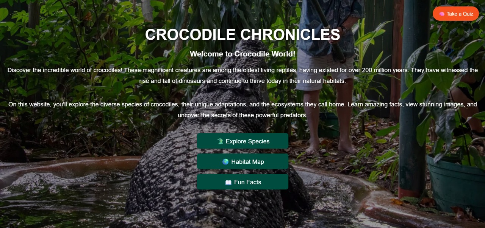
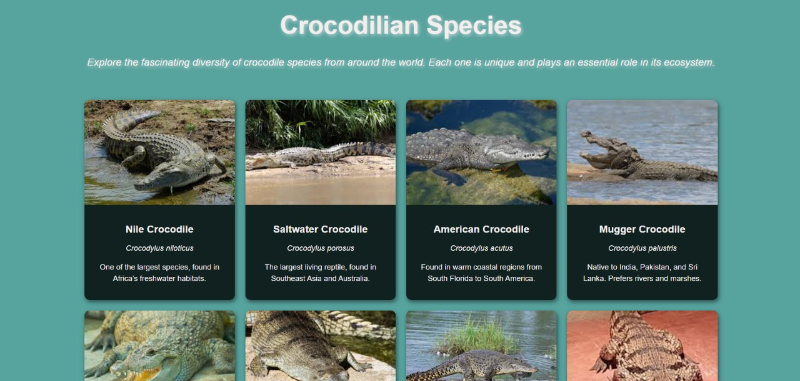
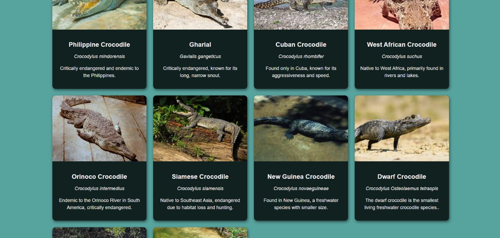
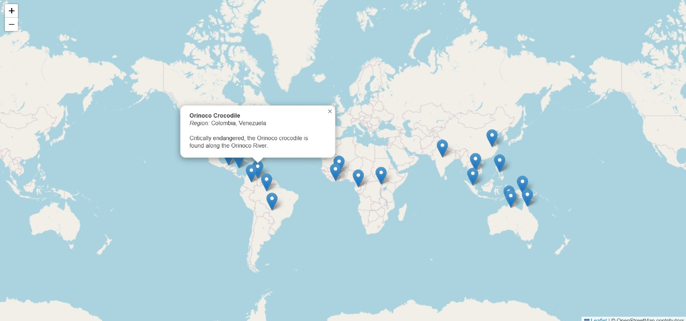
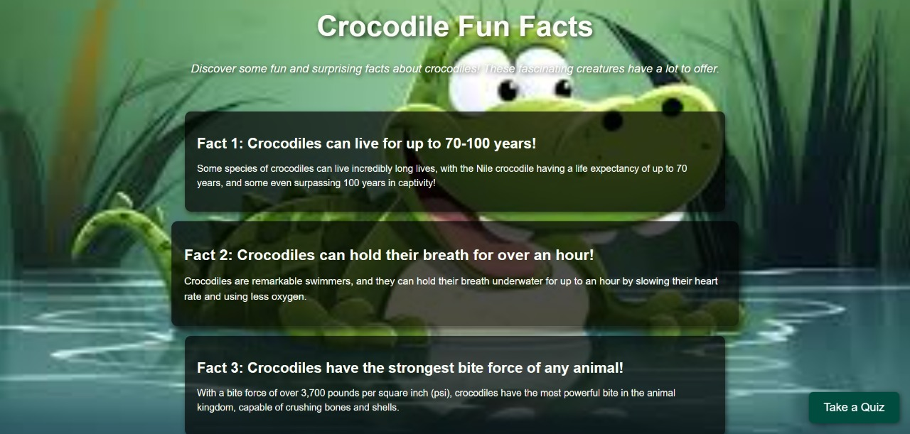
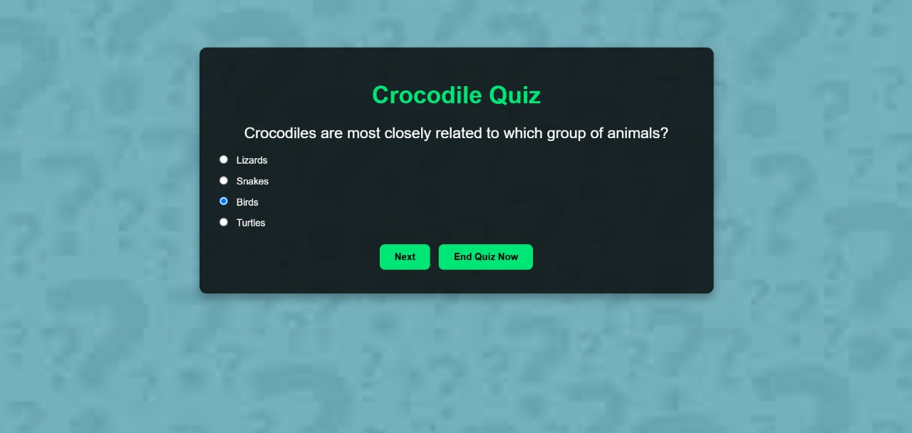

# 🐊 Crocodile Chronicles

Welcome to **Crocodile Chronicles** – your ultimate guide to the incredible world of crocodiles!  
Dive into the mysteries of these ancient reptiles, explore their habitats, discover fascinating facts, and test your knowledge with an interactive quiz.

---

## 🌟 Live Demo

🚀 Explore Crocodile Chronicles Live (https://anshita-24.github.io/Crocodile--Chronicles/)  

---
## 🧠 What You'll Discover

> _"Step into the world of crocodiles – a place where science, fun, and adventure meet!"_

- 🐊 Explore different **crocodile species** from around the world  
- 🧠 Learn **fun and jaw-dropping facts**  
- 🗺️ Discover their **natural habitats** through an interactive map  
- 🎯 Take a **quiz** to test your crocodile knowledge  
- 📱 Fully **responsive design** for mobile and desktop  
- 🌐 **Deployed** and ready to explore

---

## 💻 Tech Stack

| Technology | Description |
|------------|-------------|
| **HTML5**  | Structure and content |
| **CSS3**   | Responsive and elegant styling |
| **JavaScript** | Interactivity and logic |
| **Leaflet.js** | Interactive map for crocodile habitats |

---

## 📸 Preview

 

 
 
 

---

🌿 "Crocodiles are more than just predators – they're survivors of time. Learn, respect, and protect."

